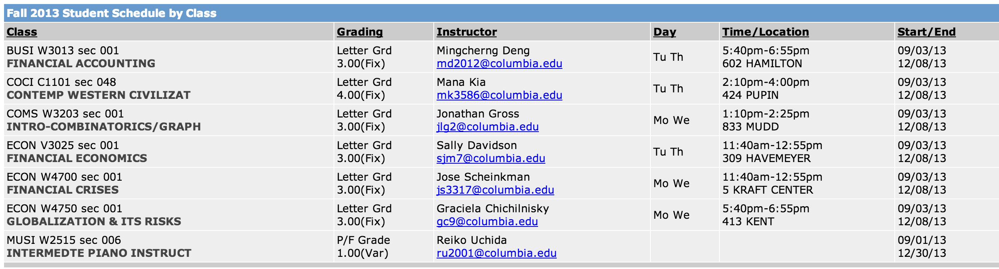

#SSOLScheduleMaker

Generates iCal Events from Columbia's SSOL Page

## Quick Start

- Download `ScheduleMarker.jar`
- Go to https://ssol.columbia.edu and log in with your uni and password on your browser
- Go to the "Student Schedule" page
- Copy the entire section titled "Fall 201x Student Schedule By Class". Make sure that it is the one By Class, not By Day

- Paste it into the giant textbox in the `ScheduleMaker.jar`
- Press `Generate Events` and the event files should be in the same directory as the jar app